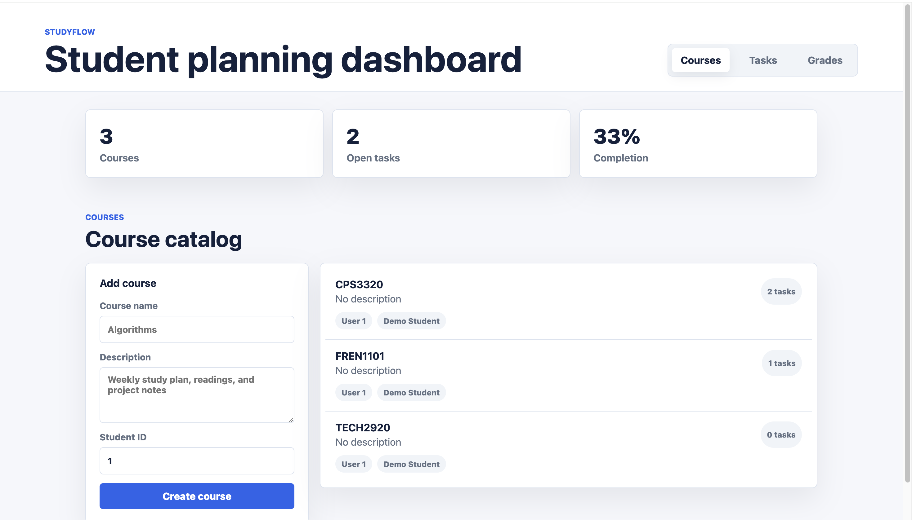
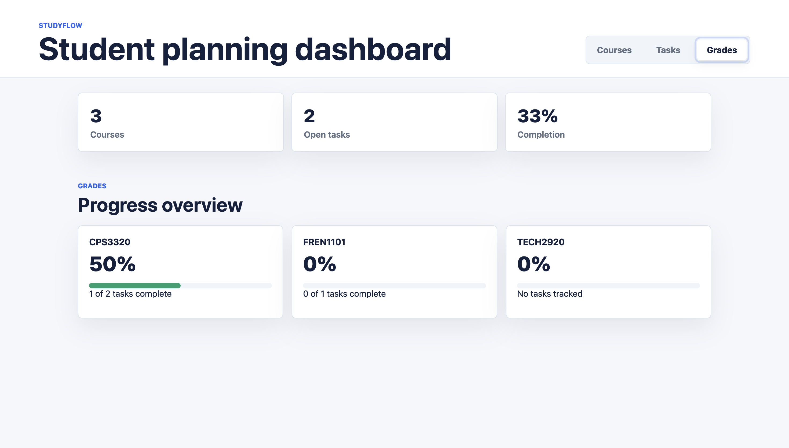

# StudyFlow
[](https://github.com/Johnny-Yip/studyflow/actions/workflows/ci.yml)

StudyFlow is a full-stack student planner built with Java 17, Spring Boot, and a static HTML/CSS/JavaScript frontend. It helps students manage courses, tasks, and grades from one dashboard, with secure JWT-based user authentication.

## Features

- User registration and login APIs
- BCrypt password hashing
- JWT authentication for API access
- Protected course, task, grade, and dashboard endpoints
- Per-user data isolation (users only access their own records)
- Course management with create, read, update, and delete support
- Task management with status tracking (`TODO`, `IN_PROGRESS`, `DONE`)
- Task search/filter/sort by title, status, priority, course, and sort mode
- Grade management with weighted score calculations
- Dashboard summary statistics (courses, tasks, completion, overdue)
- Frontend login/register flow and authenticated dashboard UI
- H2 in-memory database for local development
- JUnit + Mockito unit tests and integration tests for auth/security
- GitHub Actions CI (`mvn test`)

## Tech Stack

- Java 17
- Spring Boot 3.3.5
- Spring Web
- Spring Data JPA
- Spring Security
- JWT (`jjwt`)
- Bean Validation
- H2 Database
- Maven
- JUnit 5
- Mockito
- HTML
- CSS
- JavaScript

## Screenshots

### Dashboard



### Courses


### Tasks


### Grades



## Setup Instructions

### Prerequisites

- Java 17 or newer
- Maven 3.9 or newer
- Git

### Clone the Repository

```bash
git clone <your-repository-url>
cd StudyFlow
```

### Run the Application

```bash
mvn spring-boot:run
```

Application URL:

```text
http://localhost:8080
```

## Authentication

StudyFlow uses stateless JWT authentication.

### Demo Account (Seeded)

When the app starts with an empty database, one demo account is created:

```text
name: Demo Student
email: student@example.com
password: password123
```

### Register

```bash
curl -X POST http://localhost:8080/api/auth/register \
  -H "Content-Type: application/json" \
  -d '{
    "name": "Alice Student",
    "email": "alice@example.com",
    "password": "password123"
  }'
```

### Login

```bash
curl -X POST http://localhost:8080/api/auth/login \
  -H "Content-Type: application/json" \
  -d '{
    "email": "alice@example.com",
    "password": "password123"
  }'
```

Example auth response:

```json
{
  "token": "<jwt-token>",
  "tokenType": "Bearer",
  "userId": 2,
  "name": "Alice Student",
  "email": "alice@example.com"
}
```

Use the token for protected endpoints:

```bash
curl http://localhost:8080/api/dashboard/summary \
  -H "Authorization: Bearer <jwt-token>"
```

## H2 Database Console

The H2 console is available at:

```text
http://localhost:8080/h2-console
```

Use these settings:

```text
JDBC URL: jdbc:h2:mem:studyflow
Username: sa
Password:
```

## Frontend Usage

Open:

```text
http://localhost:8080/
```

Flow:

1. Register a new account (or sign in with the seeded demo account).
2. The app stores the JWT in browser storage.
3. All dashboard operations call protected APIs with `Authorization: Bearer <token>`.

## API Endpoint Examples

All endpoints below (except `/api/auth/**`) require `Authorization: Bearer <jwt-token>`.

### Dashboard

```bash
curl http://localhost:8080/api/dashboard/summary \
  -H "Authorization: Bearer <jwt-token>"
```

### Courses

Create a course:

```bash
curl -X POST http://localhost:8080/api/courses \
  -H "Authorization: Bearer <jwt-token>" \
  -H "Content-Type: application/json" \
  -d '{
    "name": "Algorithms",
    "description": "Graph algorithms and dynamic programming"
  }'
```

Get current user's courses:

```bash
curl http://localhost:8080/api/courses \
  -H "Authorization: Bearer <jwt-token>"
```

Get one course:

```bash
curl http://localhost:8080/api/courses/1 \
  -H "Authorization: Bearer <jwt-token>"
```

Update a course:

```bash
curl -X PUT http://localhost:8080/api/courses/1 \
  -H "Authorization: Bearer <jwt-token>" \
  -H "Content-Type: application/json" \
  -d '{
    "name": "Advanced Algorithms",
    "description": "Greedy, graphs, and DP"
  }'
```

Delete a course:

```bash
curl -X DELETE http://localhost:8080/api/courses/1 \
  -H "Authorization: Bearer <jwt-token>"
```

### Tasks

Create a task for a course:

```bash
curl -X POST http://localhost:8080/api/courses/1/tasks \
  -H "Authorization: Bearer <jwt-token>" \
  -H "Content-Type: application/json" \
  -d '{
    "title": "Finish homework 1",
    "description": "Complete exercises 1 through 10",
    "dueDate": "2026-06-01",
    "priority": "HIGH",
    "status": "TODO"
  }'
```

Get tasks for one course:

```bash
curl http://localhost:8080/api/courses/1/tasks \
  -H "Authorization: Bearer <jwt-token>"
```

Search/filter/sort tasks:

```bash
curl "http://localhost:8080/api/tasks?title=homework&status=TODO&priority=HIGH&courseId=1&sort=dueDate" \
  -H "Authorization: Bearer <jwt-token>"
```

Sort tasks by priority:

```bash
curl "http://localhost:8080/api/tasks?sort=priority" \
  -H "Authorization: Bearer <jwt-token>"
```

Get one task:

```bash
curl http://localhost:8080/api/tasks/1 \
  -H "Authorization: Bearer <jwt-token>"
```

Update a task:

```bash
curl -X PUT http://localhost:8080/api/tasks/1 \
  -H "Authorization: Bearer <jwt-token>" \
  -H "Content-Type: application/json" \
  -d '{
    "title": "Finish homework 1",
    "description": "Complete and review exercises 1 through 10",
    "dueDate": "2026-06-03",
    "priority": "MEDIUM",
    "status": "IN_PROGRESS"
  }'
```

Delete a task:

```bash
curl -X DELETE http://localhost:8080/api/tasks/1 \
  -H "Authorization: Bearer <jwt-token>"
```

### Grades

Create a grade for a course:

```bash
curl -X POST http://localhost:8080/api/courses/1/grades \
  -H "Authorization: Bearer <jwt-token>" \
  -H "Content-Type: application/json" \
  -d '{
    "assignmentName": "Midterm exam",
    "score": 92,
    "maxScore": 100,
    "weight": 30
  }'
```

Get grades for a course:

```bash
curl http://localhost:8080/api/courses/1/grades \
  -H "Authorization: Bearer <jwt-token>"
```

Get one grade:

```bash
curl http://localhost:8080/api/grades/1 \
  -H "Authorization: Bearer <jwt-token>"
```

Update a grade:

```bash
curl -X PUT http://localhost:8080/api/grades/1 \
  -H "Authorization: Bearer <jwt-token>" \
  -H "Content-Type: application/json" \
  -d '{
    "assignmentName": "Midterm exam",
    "score": 95,
    "maxScore": 100,
    "weight": 30
  }'
```

Delete a grade:

```bash
curl -X DELETE http://localhost:8080/api/grades/1 \
  -H "Authorization: Bearer <jwt-token>"
```

## Validation and Error Responses

Example validation error response:

```json
{
  "timestamp": "2026-05-26T12:00:00Z",
  "status": 400,
  "error": "Bad Request",
  "message": "Validation failed",
  "fieldErrors": {
    "name": "Course name is required"
  }
}
```

Authentication errors return `401 Unauthorized`.
Missing resources return `404 Not Found`.
Duplicate registration email returns `409 Conflict`.

## Tests

Run all tests:

```bash
mvn test
```

The suite includes:

- Service-layer unit tests for courses, tasks, grades, and dashboard
- Integration tests for registration/login
- Integration tests for protected endpoint access and data ownership isolation

## Project Structure

```text
StudyFlow
├── .github/workflows/ci.yml
├── src
│   ├── main
│   │   ├── java/com/studyflow
│   │   │   ├── config
│   │   │   ├── controller
│   │   │   ├── dto
│   │   │   ├── entity
│   │   │   ├── exception
│   │   │   ├── repository
│   │   │   ├── security
│   │   │   └── service
│   │   └── resources
│   │       ├── static
│   │       │   ├── app.js
│   │       │   ├── index.html
│   │       │   └── styles.css
│   │       └── application.properties
│   └── test
│       ├── java/com/studyflow
│       │   ├── controller
│       │   └── service
│       └── resources/mockito-extensions
├── pom.xml
└── README.md
```

## Author

Created as a portfolio project to demonstrate practical backend development, RESTful API design, secure authentication, frontend integration, and maintainable test coverage.
