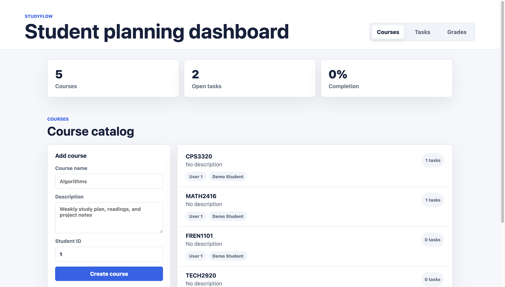
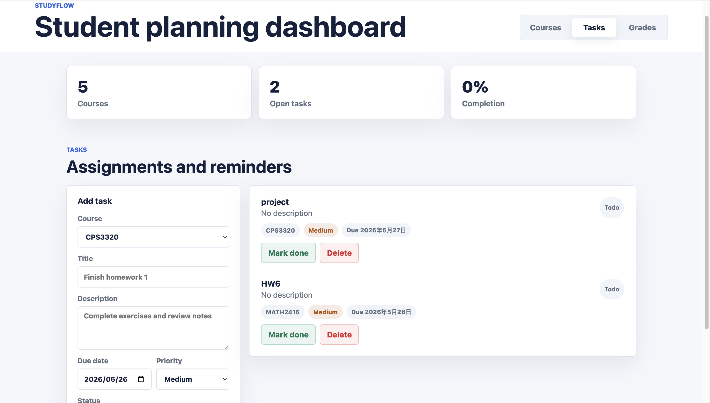

# StudyFlow

StudyFlow is a full-stack student study planning application built with Java, Spring Boot, and a lightweight HTML/CSS/JavaScript dashboard. It helps students organize courses, create assignments or reminders, track task status, and view progress from a simple browser-based interface.

This project is designed as a computer science portfolio project that demonstrates REST API design, layered Spring Boot architecture, validation, persistence with Spring Data JPA, unit testing, and a clean static frontend served directly by Spring Boot.

## Features

- Course management with create, read, update, and delete API support
- Task management for each course
- Grade management for each course
- Task status tracking with `TODO`, `IN_PROGRESS`, and `DONE`
- Priority levels with `LOW`, `MEDIUM`, and `HIGH`
- Frontend dashboard for courses, tasks, and grades
- Forms to create courses, tasks, and grades from the browser
- Buttons to mark tasks completed, edit grades, and delete records
- Request validation with structured error responses
- In-memory H2 database for easy local development
- Seeded demo student account for quick testing
- Unit tests for service-layer business logic

## Tech Stack

- Java 17
- Spring Boot 3.3.5
- Spring Web
- Spring Data JPA
- Bean Validation
- H2 Database
- Maven
- JUnit 5
- Mockito
- HTML
- CSS
- JavaScript

## Screenshots


### Courses



### Tasks



## Setup Instructions

### Prerequisites

- Java 17 or newer
- Maven 3.9 or newer
- Git

### Clone the Repository

```bash
git clone <your-repository-url>
cd StudyFlow
```

### Run the Application

```bash
mvn spring-boot:run
```

The application starts at:

```text
http://localhost:8080
```

### H2 Database Console

The H2 console is available at:

```text
http://localhost:8080/h2-console
```

Use these settings:

```text
JDBC URL: jdbc:h2:mem:studyflow
Username: sa
Password:
```

The app seeds one demo user:

```text
id: 1
name: Demo Student
email: student@example.com
```

## How to Run Tests

Run the test suite with:

```bash
mvn test
```

The tests cover the service layer for course and task workflows, including create, update, delete, and not-found behavior.

## How to Open the Frontend Dashboard

After starting the Spring Boot application, open:

```text
http://localhost:8080/
```

The dashboard is served from:

```text
src/main/resources/static
```

It calls the same REST endpoints used by the API examples below.

## API Endpoint Examples

### Courses

Create a course:

```bash
curl -X POST http://localhost:8080/api/courses \
  -H "Content-Type: application/json" \
  -d '{
    "name": "Algorithms",
    "description": "Study graph algorithms and dynamic programming",
    "userId": 1
  }'
```

Get all courses:

```bash
curl http://localhost:8080/api/courses
```

Get courses for a user:

```bash
curl "http://localhost:8080/api/courses?userId=1"
```

Get one course:

```bash
curl http://localhost:8080/api/courses/1
```

Update a course:

```bash
curl -X PUT http://localhost:8080/api/courses/1 \
  -H "Content-Type: application/json" \
  -d '{
    "name": "Advanced Algorithms",
    "description": "Greedy algorithms, graphs, and dynamic programming"
  }'
```

Delete a course:

```bash
curl -X DELETE http://localhost:8080/api/courses/1
```

### Tasks

Create a task for a course:

```bash
curl -X POST http://localhost:8080/api/courses/1/tasks \
  -H "Content-Type: application/json" \
  -d '{
    "title": "Finish homework 1",
    "description": "Complete exercises 1 through 10",
    "dueDate": "2026-06-01",
    "priority": "HIGH",
    "status": "TODO"
  }'
```

Get tasks for a course:

```bash
curl http://localhost:8080/api/courses/1/tasks
```

Get one task:

```bash
curl http://localhost:8080/api/tasks/1
```

Update a task:

```bash
curl -X PUT http://localhost:8080/api/tasks/1 \
  -H "Content-Type: application/json" \
  -d '{
    "title": "Finish homework 1",
    "description": "Complete and review exercises 1 through 10",
    "dueDate": "2026-06-03",
    "priority": "MEDIUM",
    "status": "IN_PROGRESS"
  }'
```

Delete a task:

```bash
curl -X DELETE http://localhost:8080/api/tasks/1
```

Valid priorities:

```text
LOW, MEDIUM, HIGH
```

Valid task statuses:

```text
TODO, IN_PROGRESS, DONE
```

### Grades

Create a grade for a course:

```bash
curl -X POST http://localhost:8080/api/courses/1/grades \
  -H "Content-Type: application/json" \
  -d '{
    "assignmentName": "Midterm exam",
    "score": 92,
    "maxScore": 100,
    "weight": 30
  }'
```

Get grades for a course:

```bash
curl http://localhost:8080/api/courses/1/grades
```

Get one grade:

```bash
curl http://localhost:8080/api/grades/1
```

Update a grade:

```bash
curl -X PUT http://localhost:8080/api/grades/1 \
  -H "Content-Type: application/json" \
  -d '{
    "assignmentName": "Midterm exam",
    "score": 95,
    "maxScore": 100,
    "weight": 30
  }'
```

Delete a grade:

```bash
curl -X DELETE http://localhost:8080/api/grades/1
```

Grade request fields:

```text
assignmentName: required, max 160 characters
score: required, zero or greater, must be less than or equal to maxScore
maxScore: required, greater than zero
weight: required, between 0 and 100
```

### Error Response Example

Invalid requests return structured validation errors:

```json
{
  "timestamp": "2026-05-23T12:00:00Z",
  "status": 400,
  "error": "Bad Request",
  "message": "Validation failed",
  "fieldErrors": {
    "name": "Course name is required"
  }
}
```

Missing resources return `404 Not Found`.

## Project Structure

```text
StudyFlow
├── src
│   ├── main
│   │   ├── java/com/studyflow
│   │   │   ├── config
│   │   │   ├── controller
│   │   │   ├── dto
│   │   │   ├── entity
│   │   │   ├── exception
│   │   │   ├── repository
│   │   │   └── service
│   │   └── resources
│   │       ├── static
│   │       │   ├── app.js
│   │       │   ├── index.html
│   │       │   └── styles.css
│   │       └── application.properties
│   └── test
│       ├── java/com/studyflow/service
│       └── resources/mockito-extensions
├── pom.xml
└── README.md
```

## Future Improvements

- Add user authentication and login sessions
- Add due-date filtering and task search
- Add course detail pages with analytics
- Replace the in-memory H2 database with PostgreSQL for production use
- Add integration tests for REST controllers
- Add screenshot assets and deployment instructions
- Deploy the backend and frontend to a cloud platform

## Author

Created by a computer science student as a portfolio project to demonstrate practical backend development, RESTful API design, frontend integration, and testable service-layer architecture.
